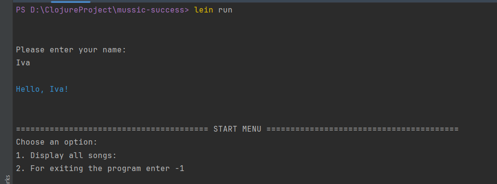
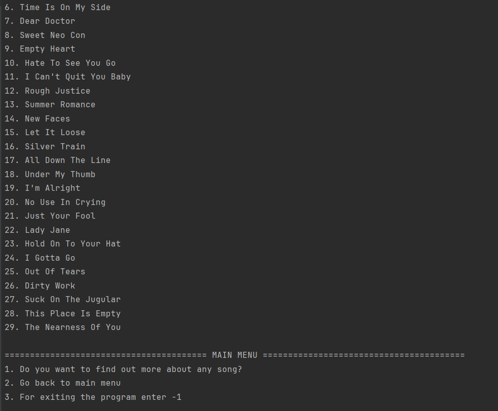
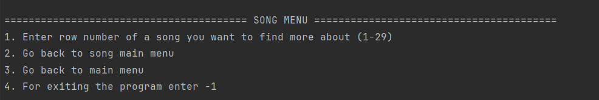
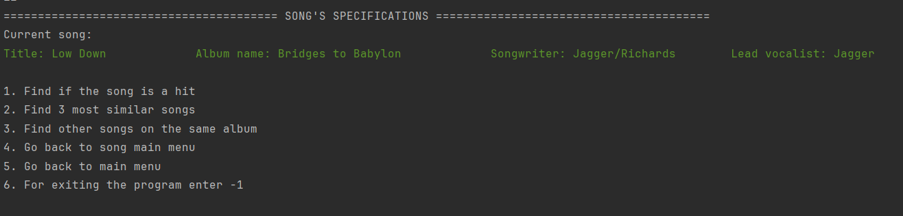
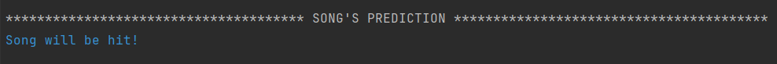

# MUSSIC SUCCESS
Music Success App is a Clojure-based application designed to help users evaluate the potential success of songs from The Rolling Stones. With this app, users can:
- Get prediction on whether a song will be a hit.
- Discover the top 3 most similar songs to any given track.
- Explore other songs on the same album.
  
## Predictions
Predictions are based on a nearest neighbor algorithm. The distance between a song and other songs is calculated using Euclidean distance. The top 7 closest songs are selected, and based on their classifications, the starting song is classified as either a hit or not a hit.

Various values of k (3, 5, and 7) were tested, but no significant difference in accuracy was observed. Therefore, k = 7 was chosen.

## Data source
The app uses a CSV file named stones_analysis.csv, which was collected for a previous project. This file includes columns for awards and chart presence in different countries: USA, UK, and POL.... 
If a song has been present on any of these charts, it is labeled as a hit.

## Data handling
Songs are shuffled and split into two sets: known and unknown, with the unknown set making up 10% of the known set. Even though the labels for unknown songs are familiar, this setup simulates a situation as if we didn't know them. When a user chooses a song, its prediction is based upon all the known songs.

## Usage
When users start the app with the lein run command, they are first asked to enter their name. After entering their name, they are provided with a start menu. Based on their choices, they can access the main menu, song menu, and song specifications menu.

## Examples
#### Start menu

#### Main menu

#### Song menu

#### Song specifications

When the user enters 1, the algorithm predicts song success.

## Testing
I utilized the Clojure.test library to test several files.
## License

Copyright © 2024 FIXME

This program and the accompanying materials are made available under the
terms of the Eclipse Public License 2.0 which is available at
http://www.eclipse.org/legal/epl-2.0.

This Source Code may also be made available under the following Secondary
Licenses when the conditions for such availability set forth in the Eclipse
Public License, v. 2.0 are satisfied: GNU General Public License as published by
the Free Software Foundation, either version 2 of the License, or (at your
option) any later version, with the GNU Classpath Exception which is available
at https://www.gnu.org/software/classpath/license.html.
